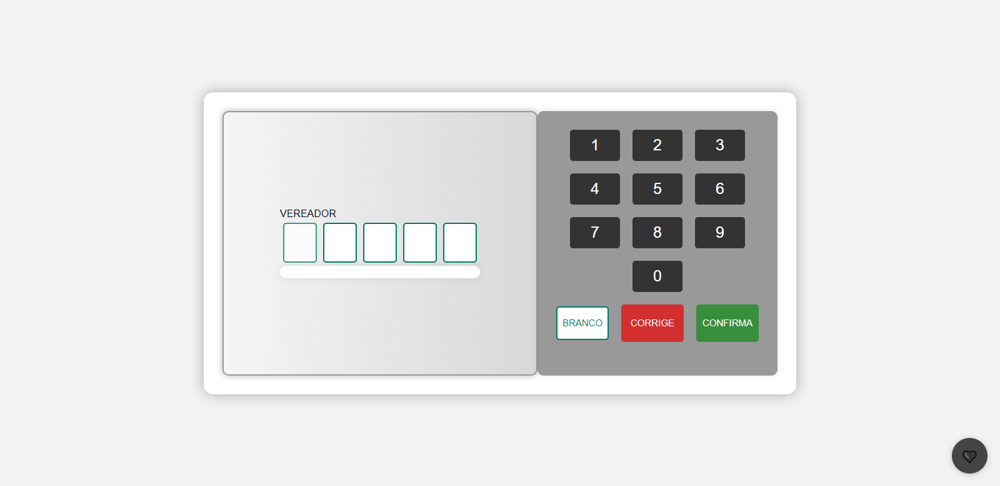
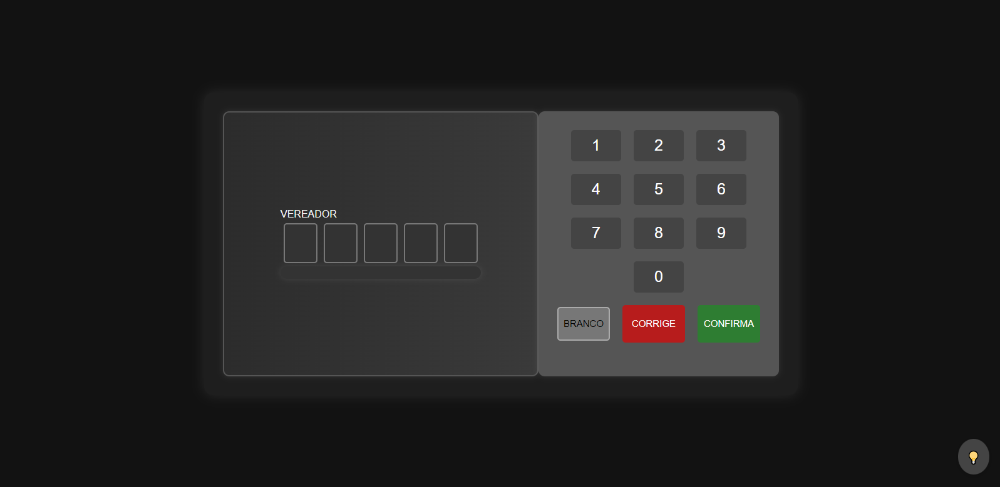

# Urna Eletrônica

um dispositivo utilizado em eleições para coletar e contar os votos de forma automatizada. Geralmente composta por uma tela sensível ao toque ou teclado, permite que os eleitores registrem suas escolhas de forma rápida e intuitiva. A urna eletrônica é projetada com medidas de segurança para garantir a integridade do processo eleitoral, como criptografia e lacres físicos. Após o encerramento da votação, os dados são processados internamente e os resultados são disponibilizados de maneira transparente e confiável. Este tipo de sistema visa proporcionar maior agilidade na apuração dos votos e reduzir possíveis erros humanos, contribuindo para a eficiência e transparência do processo democrático.

## Screenshots

## Urna White

## Urna Black

## Autores

- [@LucasFagundesWielewski](https://www.github.com/LucasFagundesWielewski)

- [@murilobonin](https://www.github.com/murilobonin)

- [@Arthur](https://www.github.com/Sarthurday)

- [@Jonh](https://www.github.com/jfkdeveloper)
